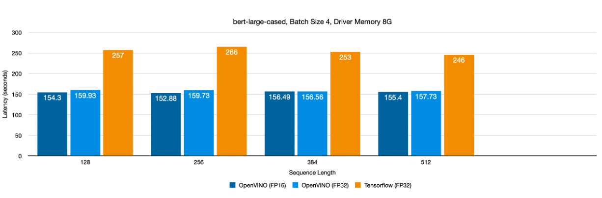
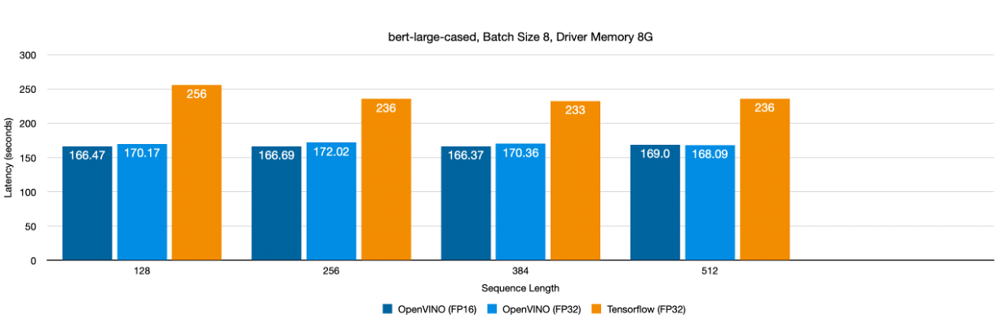
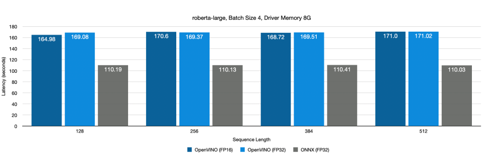

# Spark NLP-OpenVINO™ Benchmarks

This project provides a benchmarking script for measuring the time taken to run a simple Spark NLP pipeline using custom pre-trained models. A [Dockerfile](../Dockerfile) that builds an Ubuntu 20.04 image that comes installed with the OpenVINO Toolkit version 2023.0.1, Apache Spark library 3.2.3 and John Snow Labs Apache Spark NLP library is also provided to run this script.

# Dataset

The [CoNLL 2003](https://www.clips.uantwerpen.be/conll2003/) dataset used in this demo is available [here](https://github.com/JohnSnowLabs/spark-nlp/tree/master/src/test/resources/conll2003). To import the dataset into Spark NLP, use the `CoNLL.readDataset` method.

```
mkdir -p ./data/conll2003
wget https://raw.githubusercontent.com/JohnSnowLabs/spark-nlp/master/src/test/resources/conll2003/eng.train -O ./data/conll2023/eng.train
```

# Windows

The following steps describe the process of running this application on Windows 11 64-bit platforms.

## Prerequisites

- Scala 2.12.15
- OpenVINO 2023.0.1 with the Java bindings 

    Run the `setupvars` script using Command Prompt to set up OpenVINO environment variables and add the required libraries to PATH

    ```
    C:\lib\openvino-2023.0.1\setupvars.bat
    ```


- OpenJDK 8

    Verify Java installation by running 

    ```
    java -version
    ```

- Spark NLP
- Apache Spark 3.2.3

    Download Apache Spark version 3.2.3 from the official [release archives](https://archive.apache.org/dist/spark/spark-3.2.3) and extract the archive to "C:\spark-3.2.3". Then download the pre-compiled Hadoop binaries `winutils.exe` and `hadoop.dll` from [GitHub](https://github.com/cdarlint/winutils/tree/master/hadoop-3.2.0/bin). Copy these files to the folder "C:\hadoop\bin".
    
    Note: The above link is for Spark 3.2.3, which was built for Hadoop 3.2.0. Depending on the Spark version you want to use, download the appropriate winutils version.

    Set up `SPARK_HOME` and `HADOOP_HOME`, and add the binaries to PATH variable using the following commands to finish setup

    ```
    set SPARK_HOME=C:\spark-3.2.3
    set HADOOP_HOME=C:\hadoop
    set PATH=%PATH%;%HADOOP_HOME%\bin;%SPARK_HOME%\bin
    ```

    Verify the installation by running

    ```
    spark-submit --version
    ```

## Steps

- Copy the Spark NLP jar to `C:\lib\spark-3.2.3\jars\`

    ```
    copy <spark-nlp>\python\lib\sparknlp.jar C:\spark-3.2.3\jars\
    ```

- Set the following environment variables. Additional configuration can be adjusted using these [env variables](#arguments)

    ```
    set MODEL_PATH=file:/<path_to_model>
    set DATA_PATH=file:/<path_to_data>
    set JAVA_OPTS=-Xmx4g
    ```

    To use the OpenVINO inference engine, set the following environment variable

    ```
    set USE_OPENVINO=true
    ``` 

    Remove this variable to use the default Tensorflow backend

    ```
    set USE_OPENVINO=
    ```

- To run the Scala application, use the following command from the project root

    ```
    scala -classpath "%SPARK_HOME%\jars\*;app" app\BenchmarkApp.scala
    ```

    To run the application on a Spark cluster using `spark-submit`, use the following commands to compile the jar and launch the application
    
    ```
    scalac -classpath "%SPARK_HOME%\jars\*;app" app\BenchmarkApp.scala -d benchmarkapp.jar
    spark-submit --class BenchmarkApp --driver-memory 4g benchmarkapp.jar
    ```

# Ubuntu

The following steps describe the process of running this application on Ubuntu 20.04 (LTS) x64 platforms.

## Prerequisites

- Scala 2.12.15
- OpenVINO 2023.0.1 with the Java bindings 
- OpenJDK 8
- Spark NLP
- Apache Spark 3.2.3

    Download Apache Spark version 3.2.3 from the official release archives

    ```
    curl -L https://archive.apache.org/dist/spark/spark-3.2.3/spark-3.2.3-bin-hadoop3.2.tgz --output spark-3.2.3-bin-hadoop3.2.tgz
    ```

    Unpack the archive to the desired install location. The following command extracts the archive to `/opt/spark-3.2.3`

    ```
    mkdir /opt/spark-3.2.3
    sudo tar -xzf spark-3.2.3-bin-hadoop3.2.tgz -C /opt/spark-3.2.3 --strip-components=1
    ```

    Set up `SPARK_HOME` and add the binaries to PATH variable by adding the following lines to the `.bashrc` file

    ```
    vi ~/.bashrc

    # Add the following lines at the end of the .bashrc file
    export SPARK_HOME=/opt/spark-3.2.3
    export PATH=$PATH:$SPARK_HOME/bin
    ```

    Finally, load these environment variables to the current terminal session by running the following command

    ```
    source ~/.bashrc
    ```

    Verify installation by running

    ```
    spark-submit --version
    ```

## Steps

- Copy the Spark NLP jar to `/opt/spark-3.2.3/jars/`

    ```
    cp spark-nlp/python/lib/sparknlp.jar /opt/spark-3.2.3/jars/
    ```

- Set the following environment variables. Additional configuration can be adjusted using these [env variables](#arguments)

    ```
    export MODEL_PATH=file:/<path_to_model>
    export DATA_PATH=file:/<path_to_data>
    export JAVA_OPTS=-Xmx4g
    ```

    To use the OpenVINO inference engine, set the following environment variable

    ```
    export USE_OPENVINO=true
    ``` 

    Remove this variable to use the default Tensorflow backend

    ```
    unset USE_OPENVINO
    ```

- To run the Scala application, use the following command from the project root
    ```
    scala -classpath "/opt/spark-3.2.3/jars/*:app" app/BenchmarkApp.scala
    ```

    To run the application on a Spark cluster using `spark-submit`, use the following commands to compile the jar and launch the application
    
    ```
    scalac -classpath "/opt/spark-3.2.3/jars/*:app" app/BenchmarkApp.scala -d benchmarkapp.jar
    spark-submit --class BenchmarkApp --driver-memory 4g benchmarkapp.jar
    ```

# Docker

To run the script using Docker, follow these instructions. No additional dependencies are required to be set up.

## Prerequisites

- Docker 24.0.2
    
    Follow the steps [here](https://docs.docker.com/engine/install/ubuntu/) to install Docker

## Build Image

Ensure that Docker is installed and the Docker engine is running. To build the image, execute the following command from the repository root. Use the `--progress=plain` argument with the `build` command to see build progress:

```
docker build -t benchmark-app .
```

## Run Benchmarks

- Follow the instructions in this [notebook](../notebooks/Export_BERT_HuggingFace.ipynb) to export the model into a Spark NLP supported format. Create a new `models` directory and copy the exported model to this directory.

    ```
    mkdir models
    cp <path_to_model> models/
    ```

- To run as a Scala application, run the following command from the project root. The `models`, `data` and `app` folders are mounted into the container (use the full directory path on MacOS). 

    ``` 
    docker run -v ./models:/models -v ./data:/data -v ./app:/app/ -e JAVA_OPTS=-Xmx4g -e MODEL_PATH=file:/models/<model-name> -e DATA_PATH=file:/data/conll2023/eng.train -e USE_OPENVINO=true -e BATCH_SIZE=16 benchmark-app scala -classpath /opt/spark-3.2.3/jars/*:app app/BenchmarkApp.scala
    ```

- To build the jar, use the following command. A new directory `lib` is created and mounted to the container. The jar will be compiled to this directory.

    ```
    mkdir lib
    docker run -v ./lib:/lib -v ./app:/app benchmark-app scalac -classpath "/opt/spark-3.2.3/jars/*:/app" /app/BenchmarkApp.scala -d /lib/benchmarkapp.jar
    ```

    Then run the following command to launch the application using `spark-submit`

    ```
    docker run -v ./models:/models -v ./data:/data -v ./lib:/lib/ -e JAVA_OPTS=-Xmx4g -e MODEL_PATH=file:/models/bert-base-cased -e DATA_PATH=file:/data/conll2023/eng.train -e USE_OPENVINO=true -e BATCH_SIZE=16 benchmark-app spark-submit --driver-memory=4g --class BenchmarkApp /lib/benchmarkapp.jar
    ```

## Arguments
The following parameters can be adjusted through env variables:
- MODEL_PATH: path to the pre-trained model
- DATA_PATH: path to the dataset
- BATCH_SIZE: batch size for the model
- CASE_SENSITIVE: enable for case sensitive models
- USE_OPENVINO: Pass this flag to use OpenVINO backend for inference. In the absence of this argument, Tensorflow is used by default
- MODEL: The model to benchmark. Can be "BERT", "ROBERTA" or "XLMROBERTA"
- MAX_SENTENCE_LENGTH: Input sequence length

## Results

The benchmarks were run on the [eng.testa](https://github.com/JohnSnowLabs/spark-nlp/blob/master/src/test/resources/conll2003/eng.testa) validation dataset of the [CoNLL 2003 Dataset](https://www.clips.uantwerpen.be/conll2003/).

### Platform

| | |
|--------|---------------------------------|
| CPU    | 12th Generation Intel i7-12700H |
| Cores  | 14                              |
| Memory | 16 GB                           |

### bert-large-cased (Hugging Face)





### roberta-large (Hugging Face)

