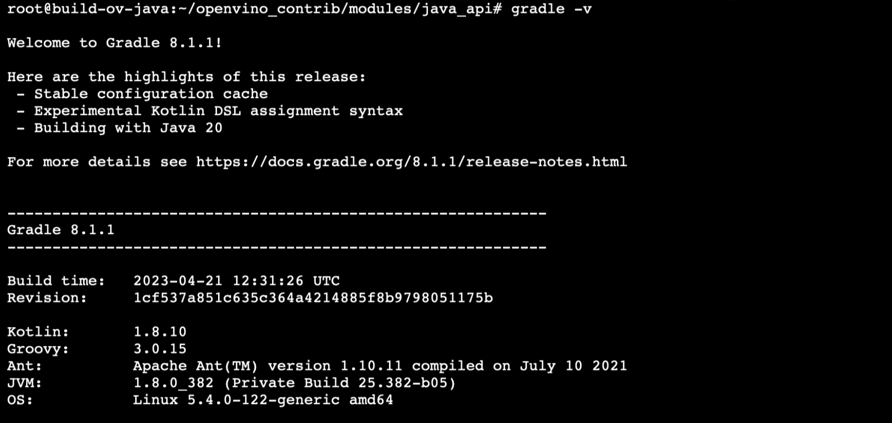
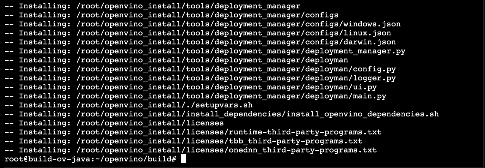
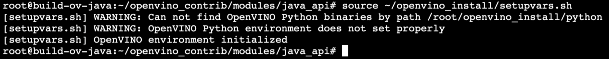
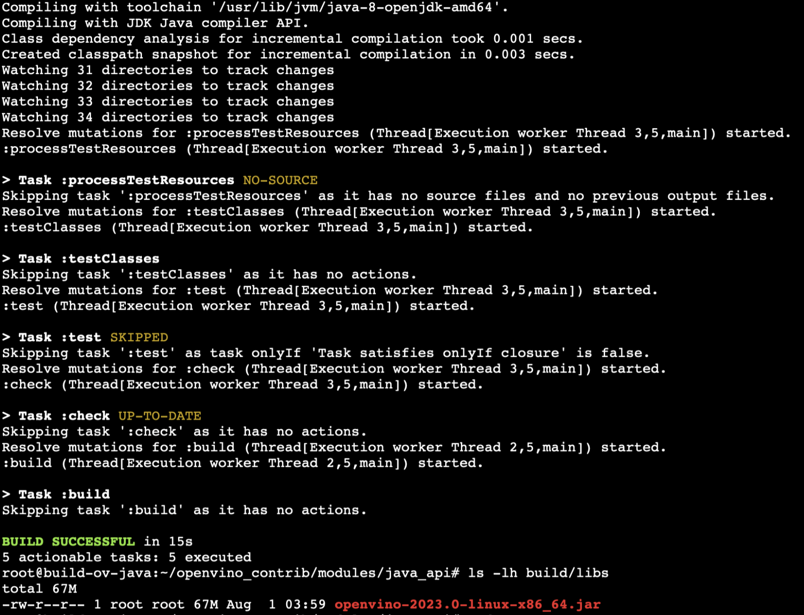

# OpenVINO™ Java (Linux) Build Instructions

This guide outlines the steps involved in building OpenVINO from the source files for Java development on Linux environments. The OpenVINO components are installed to `/opt/intel/openvino-<version>` directly and the Java module to `~/openvino_contrib/modules/java_api/build/libs`.

## Validated on

- Ubuntu 20.04 (LTS) x64
- OpenJDK version 1.8.0_382
- Gradle 8.1.1
- OpenVINO 2023.0.1

## Prerequisites

- Git
- OpenJDK 8
    ```
    sudo apt update
    sudo apt install openjdk-8-jdk
    ```
- Gradle 7.1 or higher

    1. Download the latest binary from the Gradle [distributions](https://services.gradle.org/distributions/) page

        ```
        curl -L https://services.gradle.org/distributions/gradle-8.1.1-bin.zip --output ~/gradle-8.1.1.zip
        ```

    2. Extract the zip file to `/opt/gradle`

        ```
        sudo unzip -d /opt/gradle ~/gradle-8.1.1.zip
        rm ~/gradle-8.1.1.zip
        ```

    3. Set up environment variables

        ```
        export GRADLE_HOME=/opt/gradle/gradle-8.1.1
        export PATH=${GRADLE_HOME}/bin:${PATH}
        ```

    4. Verify the installation by running

        ```
        gradle -v
        ```

        

## Build from source

1. Clone the source repositories and submodules

    ```
    git clone https://github.com/openvinotoolkit/openvino.git -b releases/2023/0
    git clone https://github.com/rajatkrishna/openvino_contrib.git -b ov-java-api
    cd openvino
    git submodule update --init --recursive
    ```

2. Run the `install_build_dependencies.sh` script in the project root folder to install the required dependencies

    ```
    chmod +x install_build_dependencies.sh
    sudo ./install_build_dependencies.sh
    ```

3. Create the build directory and run `cmake` to fetch the project dependencies and create makefiles. Specify the location of the extra modules repository using the `-DOPENVINO_EXTRA_MODULES` flag. You can disable/enable specific modules using CMake's `BUILD_<module_name>` boolean options. Optionally, you can also specify a preferred install location using the `-DCMAKE_INSTALL_PREFIX` argument. Additional build options can be found [here](https://github.com/openvinotoolkit/openvino_contrib.git). Finally, run `make` to build the project

    ```
    mkdir build && cd build
    cmake -DBUILD_java_api=ON \
        -DENABLE_PYTHON=OFF \
        -DBUILD_arm_plugin=OFF \
        -DBUILD_nvidia_plugin=OFF\
        -DCMAKE_BUILD_TYPE=Release \
        -DCMAKE_INSTALL_PREFIX=/opt/intel/openvino-2023.0 \
        -DOPENVINO_EXTRA_MODULES=~/openvino_contrib/modules \
        -DVERBOSE_BUILD=ON \
        -S ~/openvino && make --jobs=$(nproc --all)
    ```

    Note that this process may take a while to finish.

4. Once the build process has been completed, set up the install directory and install using cmake

    ```
    mkdir -p /opt/intel/openvino-2023.0
    cmake --install .
    ```

    
    
5. Next, navigate to the java module directory to build the jar. Run the `setupvars` script to set up environment variables and make the OpenVINO components visible.

    ```
    cd ~/openvino_contrib/modules/java_api
    source /opt/intel/openvino-2023.0/setupvars.sh
    ```

    

6. Run the following `gradle` command to build. If successful, the jar file will be generated to `build/libs` directory.

    ```
    gradle clean build --info
    ```

    

7. Optionally to run the tests, clone the testdata repository which contains the required models. 

    ```
    git clone https://github.com/openvinotoolkit/testdata.git -b releases/2023/0
    ```

    Then run the following gradle command 

    ```
    gradle test -Prun_tests -DMODELS_PATH=./testdata -Ddevice=CPU --info
    ```

## Build with OpenVINO 2023.0.1 Release

Alternately, you can download the OpenVINO pre-built binaries from the [release archives](https://storage.openvinotoolkit.org/repositories/openvino/packages/2023.0.1). Follow these steps to set up the Java module for OpenVINO 2023.0.1 on Linux environments.

1. Download the OpenVINO release version 2023.0.1 archive from the [downloads page](https://storage.openvinotoolkit.org/repositories/openvino/packages/2023.0.1/linux) and extract the archive to `/opt/intel/openvino-2023.0.1`. 

    ```
    curl -L https://storage.openvinotoolkit.org/repositories/openvino/packages/2023.0.1/linux/l_openvino_toolkit_ubuntu20_2023.0.1.11005.fa1c41994f3_x86_64.tgz --output openvino.tgz
    sudo mkdir -p /opt/intel/openvino-2023.0.1
    tar -xvzf openvino.tgz -C /opt/intel/openvino-2023.0.1 --strip-components=1
    ```

2. Clone the OpenVINO Contrib repository to fetch the source files for the Java module.
   
    ```
    git clone https://github.com/rajatkrishna/openvino_contrib.git -b sparknlp-integration
    ```

3. Install the OpenVINO build dependencies using the script provided in the [OpenVINO Toolkit repository](https://github.com/openvinotoolkit/openvino). Then run the `setupvars` script to make the OpenVINO components visible.

    ```
    curl -L https://raw.githubusercontent.com/openvinotoolkit/openvino/master/install_build_dependencies.sh --output install_build_dependencies.sh
    chmod +x install_build_dependencies.sh
    ./install_build_dependencies.sh
    source /opt/intel/openvino-2023.0.1/setupvars.sh
    ```

4. Create the build directory and run `cmake` to generate makefiles. Then run `make` to build the project.

    ```
    cd openvino_contrib/modules/java_api
    mkdir build && cd build
    cmake -DCMAKE_BUILD_TYPE=Release -S ..
    make -j$(nproc --all)
    ```

5. Copy the library files to the OpenVINO directory

    ```
    cp *.so /opt/intel/openvino-2023.0.1/runtime/lib/intel64
    ```

6. Run the following gradle command from the java module root to build the jar at `build/libs`

    ```
    cd ..
    gradle clean build --info
    ```

