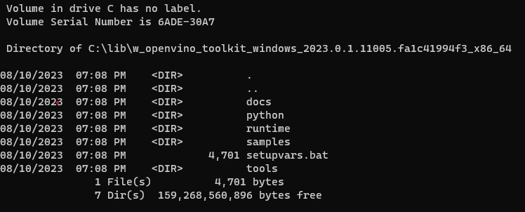

# OpenVINO™ Java (Windows) Build Instructions

This guide outlines the steps involved in building OpenVINO from the source files for Java development on Windows x86 64-bit systems. The OpenVINO components are installed to `C:\lib\openvino_install` and the Java module jar is built to `<openvino_contrib>\modules\java_api\build\libs`.

Note: Build instructions for Windows on ARM machines available [here](https://github.com/openvinotoolkit/openvino/blob/master/docs/dev/build_windows.md)

## Validated on

- Windows 11 64-bit
- OpenJDK 1.8.0_382
- Gradle 8.1.1
- Microsoft Visual Studio 2019 version 16.11.26
- CMake 3.27.1

## Prerequisites

- CMake 3.13 or higher
- OpenJDK 8
- Windows 10 x86 64-bit or higher
- Git for Windows
- Gradle 7.1 or higher
- Microsoft Visual Studio 2019 or higher, version 16.3 or later

Ensure Java is installed and available in %PATH% by running
```
java -version
```


Validate CMake installation by running
```
cmake --version
```


## Build from source

1. Clone the source repositories and submodules from the release branches on Github

    ```
    git clone https://github.com/openvinotoolkit/openvino.git -b releases/2023/0
    git clone https://github.com/rajatkrishna/openvino_contrib.git -b ov-java-api
    cd openvino
    git submodule update --init --recursive
    ```

2. Create the build and install directories. Run `cmake` to fetch the project dependencies and generate a Visual Studio solution. Specify the location of the extras repository using the `-DOPENVINO_EXTRA_MODULES` flag. You can disable/enable specific modules using CMake's `BUILD_<module_name>` boolean options. Additional build options can be found [here](https://github.com/openvinotoolkit/openvino/blob/master/docs/dev/build_windows.md#additional-build-options). Finally, using cmake, build the generated solution from the command line

    ``` 
    mkdir build && cd build
    cmake -G "Visual Studio 16 2019" ^
        -DBUILD_java_api=ON -DENABLE_PYTHON=OFF ^
        -DCMAKE_INSTALL_PREFIX=C:\lib\openvino_install ^
        -DBUILD_arm_plugin=OFF -DBUILD_nvidia_plugin=OFF ^
        -DCMAKE_BUILD_TYPE=Release ^
        -DOPENVINO_EXTRA_MODULES=<openvino_contrib>\modules ^
        -S .. && cmake --build . --config Release --verbose -j8
    ```

3. Set up the install directory and install the artifacts using cmake

    ```
    mkdir -p C:\lib\openvino_install
    cmake --install .
    ```
    
4. Before building the jar, navigate to the java module directory and run the `setupvars.bat` batch script to set up environment variables and make the OpenVINO components visible

    ```
    cd <openvino_contrib>\modules\java_api
    C:\lib\openvino_install\setupvars.bat
    ```

5. Run the following `gradle` command to build. If successful, the jar file can be found at `build/libs` directory

    ```
    gradle clean build --info
    ```

## Build with OpenVINO 2023.0.1 Release

Alternately, you can download the OpenVINO pre-built binaries from the [release archives](https://storage.openvinotoolkit.org/repositories/openvino/packages/2023.0.1). Follow these steps to set up the Java module for OpenVINO 2023.0.1 on Windows 10 or higher x86 64-bit machines.

## Prerequisites

- Git
- OpenJDK 8
- Gradle 7.1.1 or higher
- CMake 3.13 or higher
- Microsoft Visual Studio 2019 or higher, version 16.3 or later

## Build

1. Download the OpenVINO release version 2023.0.1 archive from the [downloads page](https://storage.openvinotoolkit.org/repositories/openvino/packages/2023.0.1/linux) and extract the archive to `C:\lib` so that the OpenVINO components are installed to `C:\lib\w_openvino_toolkit_windows_2023.0.1.11005.falc41994f3_x86_64`. 

    

2. Clone the [OpenVINO Contrib](https://github.com/openvinotoolkit/openvino_contrib) repository to fetch the source files for the Java module.
   
    ```
    git clone https://github.com/rajatkrishna/openvino_contrib.git -b ov-java-api
    ```

3. Run the `setupvars` batch script from Command Prompt to set up the OpenVINO environment variables and make the OpenVINO components visible. Note that the script works correctly only for Command Prompt, not Powershell. Then run `cmake` to fetch project dependencies and perform build.

    ```
    C:\lib\w_openvino_toolkit_windows_2023.0.1.11005.falc41994f3_x86_64\setupvars.bat
    mkdir build && cd build
    cmake -G "Visual Studio 16 2019" ..
    cmake --build . --config Release --verbose
    ```

    The library files will be installed to the `Release` folder. Copy the `inference_engine_java_api.dll` file to the OpenVINO install directory
    
    ```
    copy Release\inference_engine_java_api.dll C:\lib\w_openvino_toolkit_windows_2023.0.1.11005.falc41994f3_x86_64\runtime\bin\intel64\Release
    ```

4. Run the following gradle command from the java module root to build the jar at `build\libs`

    ```
    cd ..
    gradle clean build --info
    ```