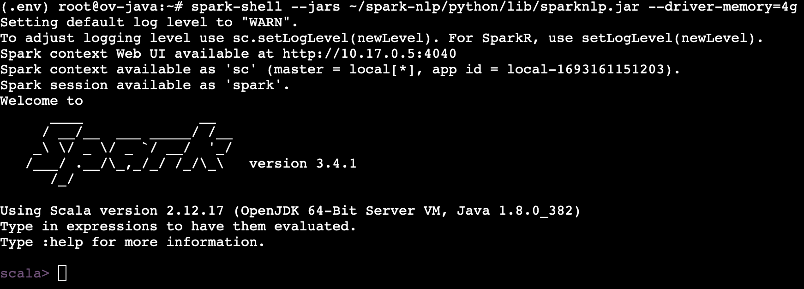
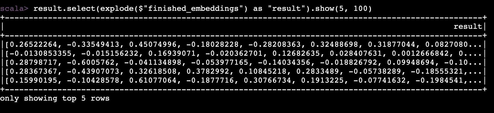

# Bert Embeddings with Spark NLP + OpenVINO™ (Linux)

This demo demonstrates the steps to import a `BERT` model from HuggingFace into Spark NLP, and use the `BertEmbeddings` annotator to generate word embeddings. 

## Prerequisites

1. OpenJDK 8 

    ```
    sudo apt update
    sudo apt install openjdk-8-jdk
    ```

2. OpenVINO 2023.0 or higher

    Follow the instructions [here](../../../openvino/build-ov-lin.md) to build OpenVINO with the Java bindings from source. Install the OpenVINO components to `/opt/intel/openvino-2023.0`. 

    Use the provided script to install the necessary dependencies.

    ```
    sudo -E /opt/intel/openvino-2023.0.1/install_dependencies/install_openvino_dependencies.sh
    ```

    Then run the `setupvars` script to set up the OpenVINO environment variables and add the libraries to PATH.

    ```
    source /opt/intel/openvino-2023.0.1/setupvars.sh
    ```

3. Spark 3.2.3 or higher

    Download Apache Spark from the official release archives.

    ```
    curl -L https://archive.apache.org/dist/spark/spark-3.2.3/spark-3.2.3-bin-hadoop3.2.tgz --output spark-3.2.3-bin-hadoop3.2.tgz
    ```

    Unpack the archive to the desired install location. The following command extracts the archive to `/opt/spark-3.2.3`

    ```
    mkdir /opt/spark-3.2.3
    sudo tar -xzf spark-3.2.3-bin-hadoop3.2.tgz -C /opt/spark-3.2.3 --strip-components=1
    ```

    Set up Apache Spark environment variables by adding the following lines to the `.bashrc` file

    ```
    vi ~/.bashrc

    # Add the following lines at the end of the .bashrc file
    export SPARK_HOME=/opt/spark-3.2.3
    export PATH=$PATH:$SPARK_HOME/bin
    ```

    Finally, load these environment variables to the current terminal session by running the following command

    ```
    source ~/.bashrc
    ```

    Verify installation by running

    ```
    spark-submit --version
    ```

4. Spark NLP 

    Follow the steps [here](../../spark-nlp-jar.md) to compile the jar from source. 


## Model

This [notebook](../../../../notebooks/Export_BERT_HuggingFace.ipynb) demonstrates how to export a BERT model from HuggingFace. In this example, we import this model into Spark NLP using the OpenVINO Runtime backend. 

Move the exported saved model directory to a new `models` folder as follows so we can locate it later

```
mkdir /root/models
mv <model_name>/saved_model/1 /root/models/bert-base-cased
```

## Bert Embeddings Pipeline with the Spark Shell

Spark provides an interactive shell which offers a convenient way to quickly test out Spark statements and learn the API. We can use this shell to demonstrate how to import a `BERT` model into Spark NLP and run a simple pipeline to produce token-level embeddings.

First, launch the Spark Scala REPL with the Spark NLP jar

```
spark-shell --jars ~/spark-nlp/python/lib/sparknlp.jar --driver-memory=2g
```



The SparkSession class is the entrypoint into all Spark functionality. The active Spark Session will be available in the shell environment as `spark`.

Import the required classes to run the pipeline.

```
import com.johnsnowlabs.nlp.embeddings.BertEmbeddings
import com.johnsnowlabs.nlp.base.DocumentAssembler
import com.johnsnowlabs.nlp.annotators.Tokenizer
import org.apache.spark.ml.Pipeline
import com.johnsnowlabs.nlp.EmbeddingsFinisher
import org.apache.spark.sql.functions.explode
```

Set the path to the model to import

```
val MODEL_PATH="file:/root/models/bert-base-cased"
```

The `DocumentAssembler` converts the raw text data into the **Document** type for further processing in Spark

```
val document = new DocumentAssembler().setInputCol("text").setOutputCol("document")
```

Next, we need to identify the tokens in the input text

```
val tokenizer = new Tokenizer().setInputCols(Array("document")).setOutputCol("token")
```

The `BertEmbeddings` class provides a `loadSavedModel` function to import external BERT models into Spark NLP. Set the `useOpenvino` flag to load the model using OpenVINO Runtime.

```
val embeddings = BertEmbeddings.loadSavedModel(MODEL_PATH, spark, useOpenvino = true).setInputCols("token", "document").setOutputCol("embeddings").setCaseSensitive(true)
```

Finally, we extract the embeddings produced by the model

```
val embeddingsFinisher = new EmbeddingsFinisher().setInputCols("embeddings").setOutputCols("finished_embeddings")
```

Now we define the pipeline with these stages

```
val pipeline = new Pipeline().setStages(Array(document, tokenizer, embeddings, embeddingsFinisher))
```

The following statements define a sample input and run the pipeline to produce word embeddings.

```
val data = Seq("The quick brown fox jumped over the lazy dog.").toDF("text")

val result = pipeline.fit(data).transform(data)

result.select(explode($"finished_embeddings") as "result").show(5, 100)
```



These embeddings can be used for further downstream tasks. For example, this [example](../bert-ner/spark-nlp-bert-ov-ner.md) demonstrates how to use the BERT embeddings for Named Entity Recognition using a pretrained `NerDLModel`.
