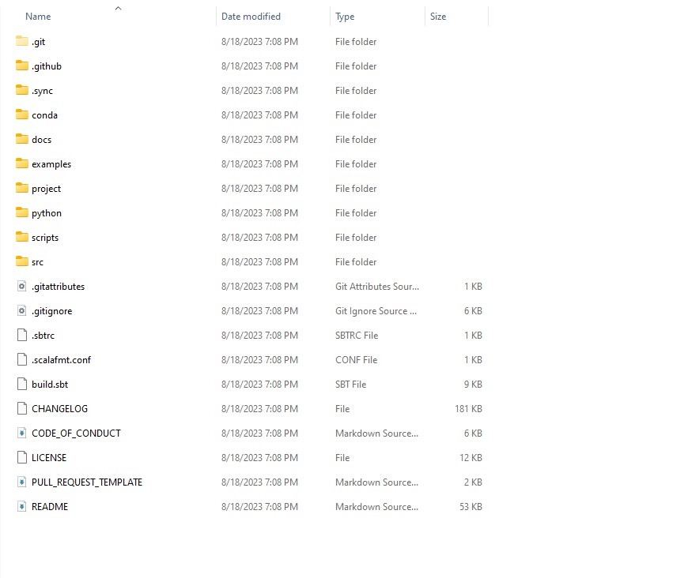
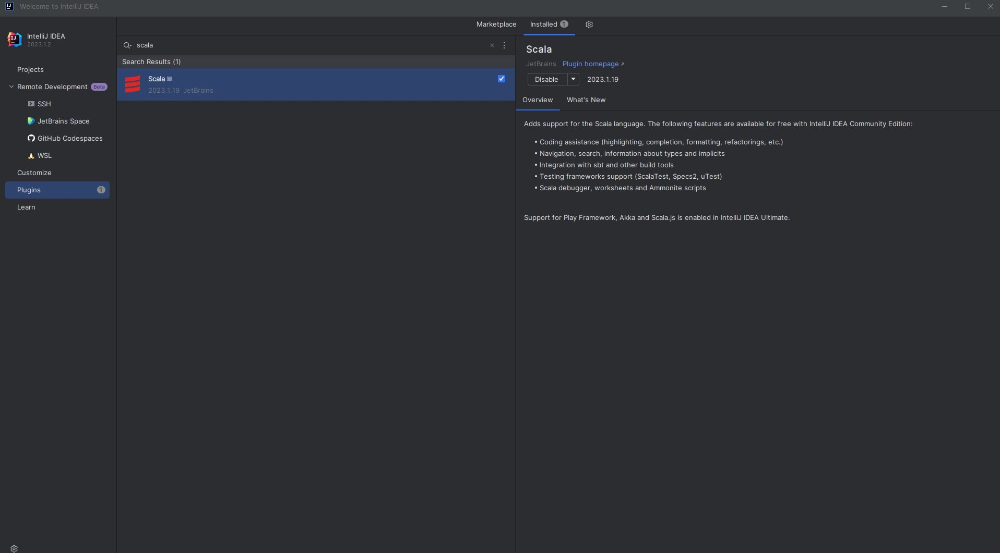
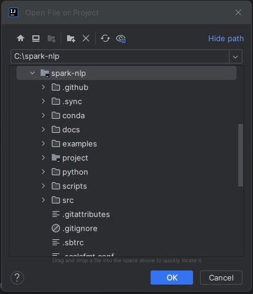
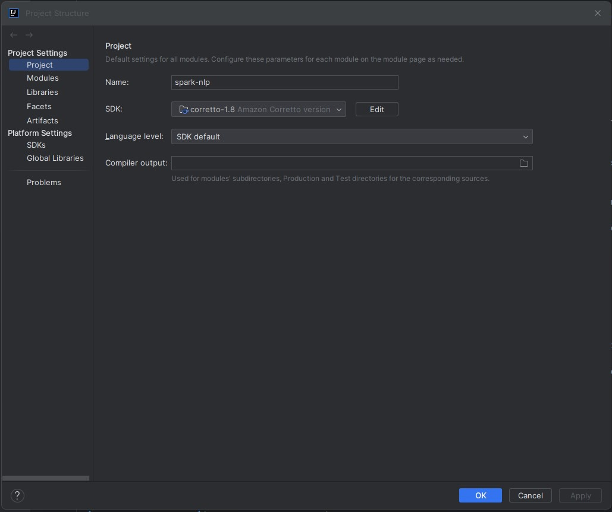
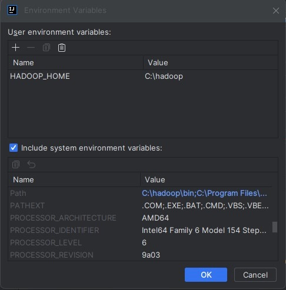
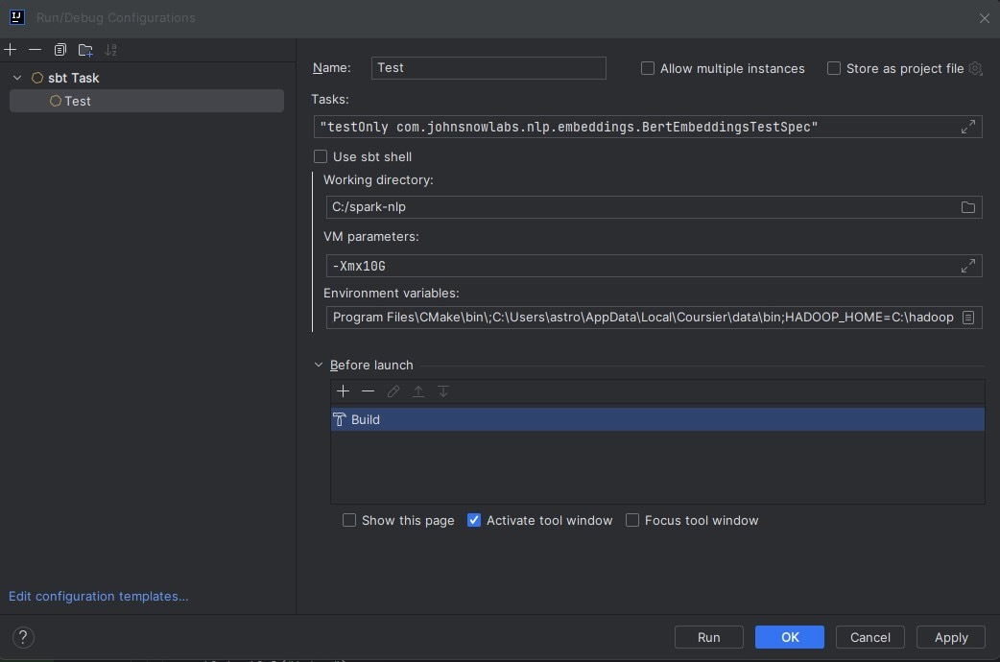
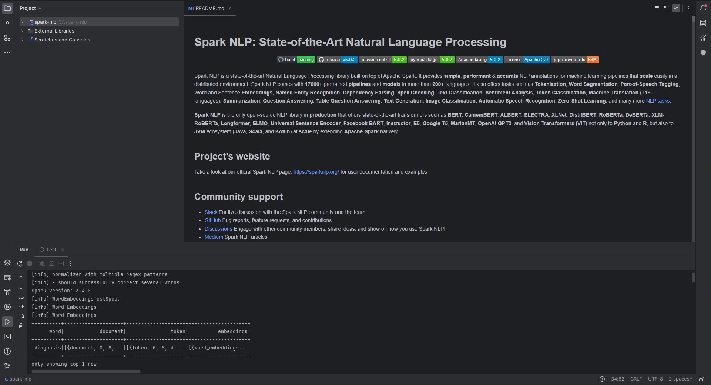

# Setting up Spark NLP for development (Windows)

This guide describes how to set up the development environment for Spark NLP in Windows platforms by importing the project into IntelliJ IDEA, run the Unit Tests and compile the Jar using IntelliJ.

## Prerequisites

- IntelliJ IDEA 2023.1 or higher
- Git
- Download the pre-compiled Hadoop binaries `winutils.exe` and `hadoop.dll` from [GitHub](https://github.com/cdarlint/winutils/tree/master/hadoop-3.2.0/bin). Copy these files to the folder "C:\hadoop\bin". These files implement posix-like file access permissions using some Windows APIs required by Hadoop to work properly on Windows.
    
    Note: The above link is for Spark 3.2.3, which was built for Hadoop 3.2.0. Depending on the Spark version you want to use, download the appropriate winutils version.

## Import Project

1. Clone the source repository from GitHub. We will use the release branch `3.4.0` in this example.

    ```
    git clone https://github.com/JohnSnowLabs/spark-nlp.git -b 3.4.0
    ```

    

2. Open IntelliJ IDEA. Before importing the project, ensure that the Scala Plugin is installed. From the welcome screen, select **Plugins** and search for "Scala". Install and enable the plugin.

    

3. From the **Projects** tab, select **Open** and locate the cloned Spark NLP repository. Click on **OK** to import the project into IntelliJ.

    

4. Once the project is imported, go to **Settings** > **Project Structure** (Ctrl + Alt + Shift + S). Under Project tab in the Project Structure dialogue, click on the SDK dropdown. If you have a local OpenJDK 8 installation, select **Add SDK** > **JDK** and locate the install directory. Otherwise, select **Add SDK** > **Download JDK**. In the Download JDK dialogue, select version 1.8 and click on Download. 

    

    Save the project settings by clicking on **Apply** and **OK**.


## Run Tests

From the **Run/Debug Configurations** dropdown, click on **Edit Configurations** to open the **Run/Debug Configurations** dialogue. Click on **Add New Configuration** and select `sbt Task`. Give the configuration a name: "Test".

In the **Tasks** input box, enter

```
test
```

To run individual tests, open the test class, right click on the class name and select **Copy / Paste Special** > **Copy Reference**. Then in the **Tasks** input box, enter the following. Replace \*classpath\* with the copied reference. 

```
"testOnly *classpath*"
```

For example, to run the BertEmbeddings annotator tests, enter "testOnly com.johnsnowlabs.nlp.embeddings.BertEmbeddingsTestSpec".

Uncheck the **Use sbt shell** checkbox and enter the following in **VM parameters** to increase the available memory:

```
-Xmx10G
``` 

Set up the Hadoop environment variables and add the binaries to PATH. Select **Edit environment variables**, and add 

```
HADOOP_HOME=C:\hadoop
```

Ensure that the **Include system environment variables** box is checked, scroll to the **Path** variable and append the path "C:\hadoop\bin".



With the configuration set up, click on **OK** to save it.



Then select the saved configuration from the **Run/Debug Configurations** dropdown and click on the **Run** button to run the tests. Alternatiely, use the **Debug** button to run the tests in debug mode.



## Build the jar

From the **Run/Debug Configurations** dropdown, click on **Edit Configurations** to open the **Run/Debug Configurations** dialogue. Click on **Add New Configuration** and select `sbt Task`. Give the configuration a name: "AssemblyCopy".

In the **Tasks** input box, enter

```
assemblyAndCopy
```

Uncheck the **Use sbt shell** checkbox and enter the following in **VM parameters** to increase the available memory:

```
-Xmx4G
``` 

Then select the saved configuration from the **Run/Debug Configurations** dropdown and click on the **Run** button. The jar file will be compiled to `spark-nlp\python\lib` folder.