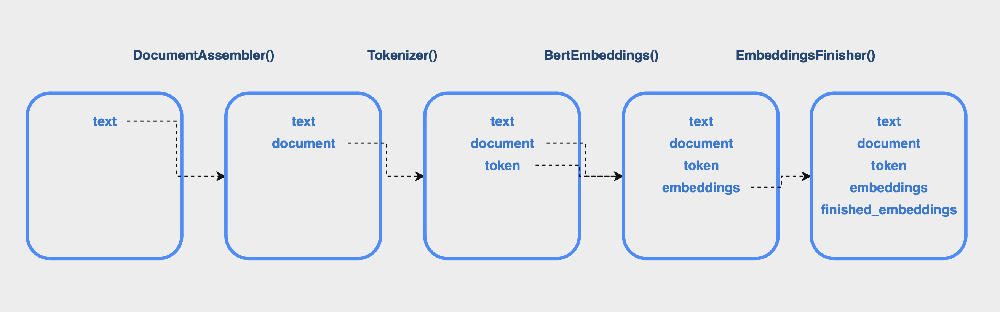

 # Spark NLP-OpenVINO™ Integration Architecture

## Introduction

 Spark NLP is an open-source Natural Language Processing library that provides simple, performant and accurate NLP annotations for machine learning pipelines that scale easily in a distributed environment. It is built on top of Apache Spark and Spark ML designed to deliver a high-performance, production-grade library with a simple-to-learn API, and provides immediate access to over 17000+ pre-trained pipelines and models in more than 200+ languages that can be easily integrated into your Spark applications with no dependency on any other NLP or ML library. Spark NLP uses a combination of rule-based algorithms, Tensorflow and ONNX Runtime ([from release 5.0](https://www.johnsnowlabs.com/spark-nlp-5-0-its-all-about-that-search/)) to power deep-learning implementations. Written in Scala, it includes Scala and Python APIs for use from Spark.

 ## General Concepts

Spark ML offers two primary components for building machine learning applications- **Estimators** and **Transformers**. Estimators can be trained on a piece of data using the `fit()` method, and Transformers, generally the result of the fitting process,  apply some transformation on a target DataFrame using the `transform()` method. Spark NLP extends these concepts through **Annotators**- the primary components that spearhead NLP tasks. There are two types of Annotators- Annotator Approaches that represent Estimators and require a training stage, and Annotator Models that represent Transformers and append the results of the current annotation to the input frame without ever deleting or replacing previous data. A Spark model is typically represented by an Annotator Model and appends a column with the predictions to the input dataframe containing the feature vectors. A list of Spark NLP Annotators and their uses can be found [here](https://sparknlp.org/docs/en/annotators).

Pipelines are a mechanism for chaining multiple annotators in a single workflow. An end-to-end NLP workflow can be represented as a Pipeline where each stage performs a relevant transformation like tokenization. The following diagram represents a simple pipeline to generate and extract word embeddings using the BertEmbeddings annotator:



The [official documentation](https://sparknlp.org/docs/en/concepts) provides more details on building and using Spark NLP pipelines with different Annotators.

## Importing a Model

Spark NLP supports importing custom models in the Tensorflow SavedModel format using the Tensorflow library, and ONNX models using ONNX Runtime library. See [here](https://github.com/JohnSnowLabs/spark-nlp/discussions/5669) for the full list of supported models and sample notebooks. With the OpenVINO integration, models that can be read and converted through the `core.read_model` + `Openvino.serialize` flow should be supported if the correct model signatures are preserved during export and model assets are placed in an `assets` folder in the exported model directory.

Annotators that support importing custom models offer a `loadSavedModel` function in their companion objects. This function accepts the model path and returns an instance of the equivalent Spark Annotator constructed from the imported model. For example, to import a BERT model into the `BertEmbeddings` annotator, we can use the following statement:

```
val bertEmbeddings = BertEmbeddings.loadSavedModel(MODEL_PATH, sparkContext)
```

During this process, the suitable model engine to use is inferred from the folder structure of the model directory. A typical imported TensorFlow SavedModel has the following structure:

```
├── assets/
    ├── your-assets-are-here (vocab, sp model, labels, etc.)
├── saved_model.pb
└── variables/
    ├── variables.data-00000-of-00001
    └── variables.index
```

An ONNX model has the following structure:

```
├── assets/
    ├── your-assets-are-here (vocab, sp model, labels, etc.)
├── model.onnx
```

And an OpenVINO format model has the following structure:

```
├── assets/
    ├── your-assets-are-here (vocab, sp model, labels, etc.)
├── saved_model.xml
├── saved_model.bin
```

The model is then read using the detected framework. The result of this operation is a model wrapper object that represents the imported model. 

For example, the `OpenvinoWrapper` class represents a model read using OpenVINO Runtime.

Finally, the underlying model of the annotator is initialized and the wrapper object is passed to the model object. This model object together with the model signature and assets are encapsulated into the resulting Annotator and returned.

## Openvino Wrapper

The `OpenvinoWrapper` class represents a model imported using OpenVINO Runtime, and comes with a companion object that offers helper functions to convert and load saved models using the Runtime API. The wrapper object contains the `CompiledModel` obtained by reading and compiling the imported model on the selected device as a non-persistent variable using the `@transient` annotation. This means that this variable will be ignored during serialization. Therefore, the wrapper object also contains the **.bin** and **.xml** files belonging to the converted IR format model loaded as byte arrays, so that the entire wrapper object can be serialized and deserialized as needed. The binary data of these files are written to disk, then read and compiled on the selected inference device to reconstruct the `CompiledModel` in the future. 

The `saveToFile` method offers a way to save the model wrapper to disk to be loaded later. The binary data of the model and weights files are written to disk and zipped, which can then be loaded again using the `OpenvinoWrapper.fromOpenvinoFormat` function.

## Adding support for a new Annotator

The entrypoint to importing an external model into a Spark NLP Annotator is the `loadSavedModel` function offered by its companion object. This function accepts 
- the local/DFS path to the model directory
- the active Spark Session: The SparkSession provides an entrypoint into Spark functionality. It can be used to get and set Spark configurations, create dataframes from data sources, etc.

The source model framework is identified from the folder structure. Using this, you must provide the implementation to either convert the model to the OpenVINO IR format first using the `OpenvinoWrapper.convertToOpenvinoFormat` method, or directly load the OpenvinoWrapper object using the `OpenvinoWrapper.fromOpenvinoFormat` method. Then assign this wrapper object to the newly created Annotator using the `setModelIfNotSet` function, which in turn initializes the corresponding model object. The model class provides a constructor that accepts the different supported model engine wrappers representing the model. For example, the [Bert](https://github.com/JohnSnowLabs/spark-nlp/blob/master/src/main/scala/com/johnsnowlabs/ml/ai/Bert.scala) class constructor accepts the model engine wrappers representing the BERT model loaded using Tensorflow, ONNX or OpenVINO. 

We then provide the implementation for running inference for each model in the corresponding model class. Each instance of this class is initialized with the appropriate model engine wrapper which it uses to run inference with. Provide the implementation for running inference using the OpenVINO backend here. If the Openvino Wrapper is received, an infer request is created and inferred with the batch tensors. When the `transform()` method is called on the Annotator, the model class uses whichever model engine wrapper was passed to it (only one model engine wrapper should be present at a time) and calls the appropriate inference implementation. If the OpenVINO model engine is detected, then we can use the compiled model stored in the Openvino wrapper to create and run an infer request. The results are then extracted and returned. 

Finally, provide the implementation for persisting and reading the model during serialization and deserialization. The Annotator should extend the `WriteOpenvinoModel` trait, which provides the implementations for saving the model wrapper in the `writeOpenvinoModel` function. Update the overriden `onWrite` method in the Annotator class to use this flow if the backend engine is OpenVINO. The `Read<Model>DLModel` trait provides the implementation for reading the saved wrapper back using the detected model framework. This trait should extend the `ReadOpenvinoModel` trait, and can use its `readOpenvinoModel` function to load the model wrapper back if the OpenVINO backend is used. 